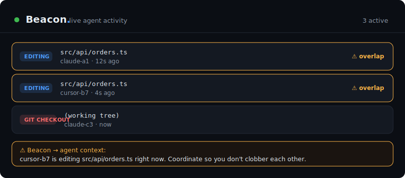

<div align="center">

# 🛰️ Beacon

### Real-time presence & collision-avoidance for parallel AI coding agents

Run two, five, ten Claude Code sessions on the same repo at once — and **never let them clobber each other's work again.**

<p align="center"><b>English</b> · <a href="README.zh-CN.md">简体中文</a></p>

[](LICENSE)
[](https://nodejs.org)
[](package.json)
[](https://docs.claude.com/en/docs/claude-code)
[](CONTRIBUTING.md)



</div>

---

## The problem

Running multiple AI coding agents in parallel is the new normal — one session refactors the API, another writes tests, a third bumps configs. It's a huge speedup, until two of them edit the same file, or one runs `git checkout` / `git stash` and silently yanks the files out from under the others. You discover the collision only *after* work is lost.

Agents are flying blind. **They can't see each other.**

## What Beacon does

Beacon is a tiny local service that gives every agent a shared, real-time picture of *who is touching what* — and warns them the instant two of them overlap.

- 👀 **Mutual awareness** — every session reports what it's editing; others can see it live.
- ⚡ **Collision warnings, in-context** — when an agent is about to edit a file another agent is already in, Beacon injects a one-line heads-up *into that agent's own context*, before the edit.
- 🔪 **Guards destructive git ops** — `checkout`, `reset --hard`, `stash`, `rebase`, `clean` while another session has unsaved edits in the tree → the agent is warned (or asked to confirm).
- 📊 **Live dashboard** — a single local web page showing every active agent, updated in real time.
- 🪶 **Weightless & invisible** — zero dependencies, 100% local, and it **never blocks your work**. No conflict? You never notice it's there.

> **Safe by design:** Beacon is advisory. It *fails open* — if the daemon is down or anything errors, your session behaves exactly as if Beacon weren't installed. It never denies an edit by default, and in the common (no-overlap) case it adds **zero tokens** to your agent's context.

---

## Quick start

```bash
# 1. Get it (Node ≥ 18)
git clone https://github.com/a1473838623/agent-beacon.git && cd agent-beacon
npm link            # puts the `beacon` command on your PATH  (or: npm i -g agent-beacon)

# 2. Wire up Claude Code + start the daemon
beacon init         # GLOBAL by default — every project on this machine is covered
beacon start -d     # start the local daemon (background)

# 3. Watch it live
open http://127.0.0.1:4517
```

That's the whole setup. **Every new Claude Code session on this machine now reports activity automatically** — no per-project steps, no per-session steps, no prompts to remember.

Open a second session, have both edit the same file, and watch the overlap light up on the dashboard while the second agent gets a warning in its context.

### Global vs project scope

`beacon init` installs **globally by default** (`~/.claude/settings.json`), so every project is covered with one command. Prefer to scope it to a single repo? Use `--project`:

```bash
beacon init             # global — all projects (recommended default)
beacon init --project   # this repo only (.claude/settings.json)
```

**The two levels are mutually exclusive — switching auto-disables the other.** Running `beacon init --project` removes the global hook; running `beacon init` again removes the project hook. This guarantees the hook never fires twice for one edit. (It cleans the global level and the *current* project; if you'd enabled several projects individually, re-run `--project` in each to switch them off.) Global monitoring is safe: conflict detection is scoped by file path and working tree, so unrelated projects never raise false overlaps — global just means "always on, everywhere."

The daemon and dashboard are already machine-wide, so with global scope the dashboard becomes a single live view of everything you're doing across every repo.

---

## How it works

```
   Claude Code session ──PreToolUse hook──┐
   Codex / MCP agent   ──MCP tools────────┤
   git / docker / CI   ──with_report──────┼──▶  beacon daemon  ──▶  live dashboard
   any editor / human  ──file watcher─────┘     (local HTTP, JSONL)     + in-context warnings
```

One idea, all the way down: **an activity is `{ actor, action, target }`** — "session A is *editing* `orders.ts`". Everything is a client that reports activities; the daemon detects overlaps and answers *"is anyone else on this?"*. That's it.

- **Report** and **query** are the only two operations. `report` even returns the conflicts in its response, so an agent learns of an overlap in the same call it announces its own work.
- **Reporting is out-of-band** (a hook / a shell wrapper), so your agent spends no tokens announcing itself.
- **Awareness is surfaced only on a real conflict** — a short, relevant line, exactly when it matters.

---

## Integrations

Beacon is **not locked to Claude Code**. The core is a language-agnostic local HTTP bus; each integration is just a way to feed it activities.

| Actor | How it reports | Gets in-context warnings? |
|---|---|---|
| **Claude Code** | `beacon init` (PreToolUse hook) — automatic, zero-config | ✅ yes, injected before the edit |
| **Codex** | `beacon init --codex` (MCP server) + one line in `AGENTS.md` | ➖ can query & report; the model decides how to act |
| **Any MCP agent** *(Cursor, Cline, Windsurf, Zed, Claude Agent SDK)* | point its MCP config at `beacon mcp` — `report_activity` / `get_activity` tools | ➖ can query & report |
| **git / docker / CI scripts** | `with_report <action> <target> -- <cmd>` | — |
| **Any editor or human** | `beacon watch <dir>` (file-system watcher) | — |
| **Anything that speaks HTTP** | `POST /report` | — |

Claude Code gets the richest experience because its hooks let Beacon both auto-report *and* inject the warning back into the agent mid-task. Every other tool still shows up on the dashboard and in everyone else's warnings.

### Codex & other MCP clients

Beacon ships a zero-dependency **MCP server**, so any MCP-capable agent can report and query activity on the same bus your Claude Code sessions use.

**Codex:**

```bash
beacon init --codex      # adds [mcp_servers.beacon] to ~/.codex/config.toml (global)
beacon start -d
```

(Global by default; `beacon init --codex --project` scopes it to `.codex/config.toml`, and switching levels disables the other — same as the Claude hook.)

Optionally add one line to your `AGENTS.md` so Codex uses it proactively:

> Before editing a file or running a risky command, call the `beacon` `get_activity` / `report_activity` tools to avoid colliding with other agents.

**Cursor / Cline / Windsurf / Zed / Claude Agent SDK:** point the client's MCP config at the server (`command: node`, `args: ["<install>/mcp/server.js"]`, or just `beacon mcp` if `beacon` is on PATH).

**What Codex gets today — be clear-eyed:**

- ✅ **Visible to every other agent.** Codex's activity shows on the dashboard and in other agents' warnings — via the MCP tools, or with *zero* Codex config via `beacon watch`.
- ✅ **Can check for collisions itself.** Codex can call `get_activity` / `report_activity` — proactively only if you add the `AGENTS.md` line above (otherwise it's available but the model won't call it on its own).
- ❌ **No automatic pre-edit warning *inside* Codex.** Unlike Claude Code, Codex can't have a warning injected before an edit: its hooks fire only on Bash (not file writes) and can't add context. This is a Codex platform limitation, not a Beacon one.
- 🔜 **Hard-block destructive git on conflict** — planned, via a Codex Bash hook (Codex hooks *can* deny). See the [roadmap](#roadmap).

In short: **Claude Code = fully automatic, warned before every edit. Codex = visible to everyone + can query on request, but not auto-warned.**

---

## Configuration

All optional — sensible defaults out of the box. Set as environment variables.

| Variable | Default | Meaning |
|---|---|---|
| `BEACON_PORT` | `4517` | Daemon port (localhost only) |
| `BEACON_GUARD` | `warn` | `warn` = advisory context · `ask` = require confirm on destructive git ops · `off` = report only, never warn |
| `BEACON_TTL_MS` | `900000` | How long an activity lives without a heartbeat (15 min) — crashed sessions self-clear |
| `BEACON_LOG_LEVEL` | `info` | `error` · `warn` · `info` · `debug`. Errors/warnings are always recorded; `debug` traces every report. |
| `BEACON_HOME` | `~/.beacon` | Where the daemon stores its pidfile, activity log, and `beacon.log` |

---

## Troubleshooting & reporting bugs

Beacon fails open silently by design — so if something's off, the trail is in the **local log**, not your terminal.

```bash
beacon logs                 # last 200 lines + the log path
beacon logs --tail 50       # fewer lines
beacon logs --path          # just print the file path (~/.beacon/beacon.log)
beacon logs --clear         # wipe it
```

Errors and warnings (including every time the hook *fails open* because the daemon was unreachable) are always logged. For a full trace while reproducing a problem, restart with more detail:

```bash
BEACON_LOG_LEVEL=debug beacon start   # logs every report and tool call
```

Found a bug? Please [open an issue](https://github.com/a1473838623/agent-beacon/issues/new?template=bug_report.yml) and paste `beacon logs` output (**review it first** — it can contain file paths from your project). The log is 100% local; nothing is ever sent anywhere unless you attach it yourself.

---

## FAQ

**Will this slow my agents down or blow up my token usage?**
No. Reporting happens out-of-band (in the hook, not the model), so it costs zero model tokens. The only thing ever added to an agent's context is a single warning line, and only when there's a genuine overlap. No conflict → nothing added.

**Can it break my workflow / block an edit?**
Not by default. It's advisory and fails open — daemon down, timeout, bad input, all result in "do nothing, allow." Set `BEACON_GUARD=ask` only if you *want* destructive git ops to pause for confirmation on a real conflict.

**Does it send my code anywhere?**
No. Everything is local — a daemon on `127.0.0.1`, an append-only log under `~/.beacon`. No network, no telemetry, no accounts.

**Does it replace git / locks / worktrees?**
No — it's the awareness layer *underneath* them. It doesn't take locks or move files; it makes agents *see* each other so they (or you) can coordinate. Pairs perfectly with git worktrees if you use them.

**An activity is still showing after I stopped editing?**
It clears when your session's turn ends (a Stop hook) and otherwise fades a few minutes after the last edit. You can also hit **Clear** on the dashboard to wipe the board instantly — plus **Restart** / **Quit** the daemon right from the header (or `beacon restart` / `beacon stop`). Upgrading from an older version? Re-run `beacon init` to add the Stop hook, then `beacon restart`.

---

## Roadmap

- [x] Native **MCP server** (`report_activity` / `get_activity`) — works with Codex, Cursor, Cline, Windsurf, Zed, and the Claude Agent SDK
- [ ] `beacon init --codex` also installs a Codex Bash hook to hard-block destructive git ops on conflict
- [ ] `SessionStart` hook: greet each new session with a summary of what peers are doing
- [ ] Optional hard **leases** for resources that truly need serialization (e.g. one build at a time)
- [ ] Slack / desktop notification on overlap
- [ ] `npx agent-beacon` zero-install runner

Ideas and PRs welcome — see [CONTRIBUTING.md](CONTRIBUTING.md).

---

## Contributing

Beacon is intentionally tiny (a few hundred lines, no dependencies). That makes it easy to read, easy to hack on, and easy to trust. Run the tests with `npm test`. Issues and pull requests are very welcome.

## License

[MIT](LICENSE) © Beacon contributors
