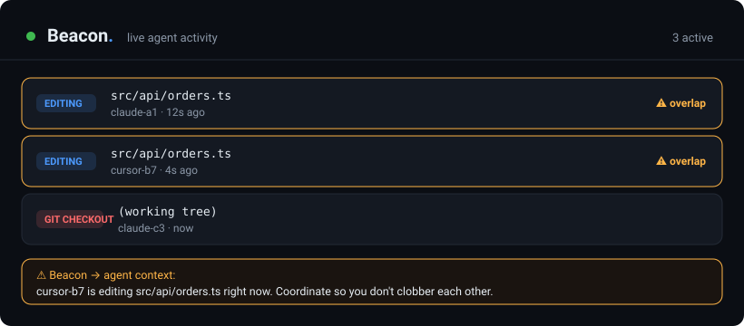

<div align="center">

# 🛰️ Beacon

### 面向并行 AI 编码 agent 的实时在场感知与碰撞规避

在同一个仓库里同时跑 2 个、5 个、10 个 Claude Code 会话 —— 从此**不再让它们互相覆盖对方的改动**。

<p align="center"><a href="README.md">English</a> · <b>简体中文</b></p>

[](https://www.npmjs.com/package/beacon-agents)
[](LICENSE)
[](https://nodejs.org)
[](package.json)
[](https://docs.claude.com/en/docs/claude-code)
[](CONTRIBUTING.md)



</div>

---

## 痛点

并行跑多个 AI 编码 agent 已经是常态 —— 一个会话重构 API,另一个写测试,第三个改配置。速度确实翻倍,直到其中两个改到了同一个文件,或者某个会话跑了 `git checkout` / `git stash`,悄无声息地把别人正在改的文件从脚下抽走。而你往往是在**改动已经丢了之后**才发现碰撞。

Agent 们在盲飞。**它们看不见彼此。**

## Beacon 做什么

Beacon 是一个极小的本地服务,给每个 agent 一张共享的、实时的"谁在动什么"的画面 —— 并在两者刚一重叠的瞬间就发出提醒。

- 👀 **互相感知** —— 每个会话上报自己在改什么,其他人实时可见。
- ⚡ **上下文内的碰撞警告** —— 当一个 agent 即将编辑另一个 agent 已经在改的文件时,Beacon 会在编辑发生**之前**,把一行提醒**注入到该 agent 自己的上下文里**。
- 🔪 **守卫共享工作树的危险操作** —— 当别的会话正在编辑这棵树时,`checkout` / `reset --hard` / `stash` / `rebase` / `clean`,*以及* `git add -A` / `commit -a`(会把别人未提交的改动一并卷进你的提交)都会让 agent 收到警告(或被要求确认)。
- 🔁 **提示重复的编译/部署** —— 如果某个目录里已经有编译或部署在跑,另一个 agent 再起一个会被提醒"这只是白烧 CPU/Docker"。并行没问题,*重复*才是浪费。
- 📊 **实时面板** —— 实时展示每一个活跃 agent,**按会话配色**,每行有**详情**,可切换**白天/黑夜**,可选**按会话或对话轮聚合编辑**,还有**设置**面板(检查更新、开机自启、按天看日志)。
- 🪶 **轻若无物、无感知** —— 零依赖、100% 本地,而且**永不阻塞你的工作**。没有冲突时,你根本察觉不到它在运行。

> **设计上就安全:** Beacon 是 advisory(建议式)的。它*失败即放行(fail open)* —— 一旦守护进程没起或任何环节出错,你的会话行为跟没装 Beacon 时**完全一样**。默认永不拒绝任何编辑;在常见的(无重叠)情况下,它给 agent 上下文增加的 token 是**零**。所有数据都不出本机 —— 见 [PRIVACY.md](PRIVACY.md)。

---

## 快速开始

按你的使用方式挑一种安装。两种方式连的是同一个本地守护进程,而且**可以同时装** —— Beacon 会在运行时抑制重复上报。

### Claude Code —— 装插件(推荐)

```bash
/plugin marketplace add a1473838623/agent-beacon
/plugin install beacon@agent-beacon
```

配置到此为止。插件同时带上 hook **和** MCP 服务器,守护进程会在第一次编辑时自行拉起 —— 不需要再跑任何命令。Beacon 会出现在 `/plugin` 和 `/mcp` 里,想关掉直接在那里关,不用改任何配置文件。

### Codex —— 装插件

```bash
codex plugin marketplace add a1473838623/agent-beacon
```

然后在 `codex /plugins` 里安装 `beacon`,再跑 `/hooks` 信任它的 hook。
和 Claude Code 插件是同一套 hook、同一个 MCP 服务器、同一个守护进程。

### CLI —— 要 `beacon` 命令、看板,或者接非 Claude Code 的 agent

一条命令,全平台通用:

```bash
npm i -g beacon-agents
```

然后:

```bash
beacon init         # 默认全局 —— 本机所有项目都覆盖
beacon start -d     # 后台启动本地守护进程
open http://127.0.0.1:4517
```

**Windows 注意:** `npm i -g` 会写进 Node 的全局目录,而无论官方安装包还是 nvm,
那个目录都在 `C:\Program Files` 下 —— 不以管理员身份运行就会 `EPERM` 失败。
遇到这种情况改用安装脚本,它不需要提权:装到 `%LOCALAPPDATA%`,并把 shim 放进用户 PATH。

```powershell
irm https://raw.githubusercontent.com/a1473838623/agent-beacon/main/install.ps1 | iex
```

要改 Beacon 本身?那就 clone 下来 `npm link`:

```bash
git clone https://github.com/a1473838623/agent-beacon.git && cd agent-beacon && npm link
```

> **npm 包名是 [`beacon-agents`](https://www.npmjs.com/package/beacon-agents),不是 `agent-beacon`。**
> npm 会去掉标点后比较包名,而 `agent-beacon` 规范化后与一个无关的、仍在活跃维护的包
> `agentbeacon` 完全撞名。仓库名、Claude Code 插件名、marketplace 名和 `beacon` 命令都不受影响
> —— 只有 `npm install` 用的是这个不同的名字。

**本机新开的每个 Claude Code 会话现在都会自动上报活动** —— 无需每个项目单独配、无需每个会话手动操作,也没有需要记住的提示词。

再开一个会话,让两个会话都去改同一个文件,你会看到面板上 overlap 亮起,同时第二个 agent 在它的上下文里收到警告。

### 两种安装同时存在时

不会出问题。Claude Code 会执行每一处匹配的 hook 注册,所以插件 + `beacon init` 同时存在时,每次编辑会把 hook 脚本拉起两到三遍 —— 但每个事件只会被处理一次。每个 hook 会给收到的事件算指纹并原子地"认领"它,先到的那个进程干活,其余的静默退出(`src/dedupe.js`)。不会有重复的行、重复的警告,也不会把冲突数算重。

但这终究是白跑的进程,所以 Beacon 会主动告诉你:

```bash
beacon doctor       # 列出 Beacon 被注册在哪些地方,并标出多余的
beacon uninit       # 移除 settings.json 里的 hook(切换到插件时用)
```

`beacon init` 也会检测到已装的插件并直接停下,而不是再叠一层(用 `--force` 可强行覆盖)。

### 全局 vs 项目级

`beacon init` **默认全局安装**(`~/.claude/settings.json`),一条命令覆盖所有项目。只想作用于某一个仓库?用 `--project`:

```bash
beacon init             # 全局 —— 所有项目(推荐默认)
beacon init --project   # 只这个仓库(.claude/settings.json)
```

**两个级别互斥 —— 切换时自动关闭另一个。** 跑 `beacon init --project` 会移除全局 hook;再跑 `beacon init` 会移除项目 hook。这样保证同一次编辑绝不会触发两遍。(它会清理全局级 + *当前*项目;如果你之前逐个开了多个项目,切换时需在每个里重新跑一次 `--project` 关掉。)全局监控是安全的:冲突判定按文件路径和工作树划分,不相关的项目永远不会误报 overlap —— 全局只是"到处常开"。

守护进程和面板本来就是机器级的,所以全局作用域下,面板会变成一张"你在所有仓库里正在做什么"的实时总览。

---

## 工作原理

```
   Claude Code 会话  ──PreToolUse hook──┐
   Codex / MCP agent  ──MCP 工具────────┤
   git / docker / CI  ──with_report─────┼──▶  beacon 守护进程  ──▶  实时面板
   任意编辑器 / 人     ──文件监听────────┘      (本地 HTTP, JSONL)     + 上下文内警告
```

一个理念贯穿到底:**一条活动就是 `{ actor, action, target }`** —— "会话 A 正在*编辑* `orders.ts`"。一切都是向总线上报活动的客户端;守护进程负责检测重叠,并回答*"还有别人在动这个吗?"*。就这么简单。

- **上报(report)** 和 **查询(query)** 是仅有的两个操作。`report` 的响应里甚至直接带回冲突,所以一个 agent 在"宣告自己在做什么"的同一次调用里,就得知了重叠。
- **上报是带外的**(在 hook / shell 包裹里完成),所以你的 agent 为"宣告自己"花费的 token 是零。
- **只有真正发生冲突时才浮现感知** —— 一行简短、切题的提示,恰好在需要的时候出现。

---

## 集成

Beacon **并不锁定在 Claude Code 上**。内核是一条语言无关的本地 HTTP 总线;每种集成只是把活动喂给它的一种方式。

| 参与方 | 如何上报 | 能收到上下文内警告吗? |
|---|---|---|
| **Claude Code** | 装插件(或 `beacon init`)—— 自动、零配置 | ✅ 能,在编辑前注入 |
| **Codex** | 装插件(hook + MCP),或 `beacon init --codex` 只接 MCP | ✅ 装插件后能,在编辑前注入 |
| **任意 MCP agent** *(Cursor、Cline、Windsurf、Zed、Claude Agent SDK)* | 把它的 MCP 配置指向 `beacon mcp` —— `report_activity` / `get_activity` 工具 | ➖ 能查询和上报 |
| **git / docker / CI 脚本** | `with_report <action> <target> -- <cmd>` | — |
| **任意编辑器或人** | `beacon watch <dir>`(文件系统监听) | — |
| **任何会说 HTTP 的东西** | `POST /report` | — |

Claude Code 体验最好,因为它的 hook 让 Beacon 既能自动上报,又能把警告在任务进行中注入回 agent。其他工具依然会出现在面板上,以及别人的警告里。

### Codex 与其他 MCP 客户端

Beacon 自带一个零依赖的 **MCP 服务器**,任何支持 MCP 的 agent 都能在同一条总线上(和你的 Claude Code 会话共用)上报与查询活动。

**Codex:**

```bash
beacon init --codex      # 往 ~/.codex/config.toml 加入 [mcp_servers.beacon](全局)
beacon start -d
```

(默认全局;`beacon init --codex --project` 作用于 `.codex/config.toml`,切换级别时自动关闭另一个 —— 和 Claude hook 一致。)

**Codex —— 装插件(推荐):**

```bash
codex plugin marketplace add a1473838623/agent-beacon
```

然后在插件浏览器里安装 `beacon`(`codex /plugins`)。插件同时带上 hook **和** MCP 服务器,
和 Claude Code 那个插件是同一个仓库、同一个守护进程。

> Codex 不会自动信任插件里的 hook。装完之后跑 `/hooks`,审阅并信任 Beacon 的三个 hook,
> 否则 hook 不会执行(MCP 工具不受影响,两种情况下都能用)。

**或者只接 MCP 服务器**,完全不需要安装任何东西:

```toml
# ~/.codex/config.toml
[mcp_servers.beacon]
command = "npx"
args = ["-y", "beacon-agents", "mcp"]
```

**或者用 CLI**(前提是 `beacon` 已在 PATH 上):`beacon init --codex`。

三种接法连的都是同一个本地守护进程,所以和 Claude Code 会话互相可见。
**把 Beacon 装成插件并不会让它变成 Claude Code 专属** —— 守护进程才是总线。

可选:在你的 `AGENTS.md` 里加一行,让 Codex 主动使用:

> 在编辑文件或运行有风险的命令前,先调用 `beacon` 的 `get_activity` / `report_activity` 工具,避免和其他 agent 撞车。

**Cursor / Cline / Windsurf / Zed / Claude Agent SDK:** 把该客户端的 MCP 配置指向本服务器。免安装写法:`command: npx`,`args: ["-y", "beacon-agents", "mcp"]`。若 `beacon` 已在 PATH 上,用 `beacon mcp` 也可以。

**装了插件之后,Codex 能得到什么:**

- ✅ **编辑前被自动警告。** Codex 的 `PreToolUse` 对**文件编辑**也触发(不只是 shell),
  而且接受和 Claude Code 相同的 `additionalContext` 输出。同一行重叠警告会被注入
  Codex 自己的上下文。
- ✅ **同样守着破坏性 git**、`git add -A` / `commit -a`、以及重复的构建/部署。
- ✅ **回合结束时清除自己的存在**(靠 `Stop` hook),面板上不会留下过期条目。
- ✅ **对其他所有 agent 可见**,出现在面板和别人的警告里。

一个实现细节:Codex 把文件编辑表达为 `apply_patch`,给 hook 的是
`tool_input.command` 里的整块补丁而不是路径,而且一次调用可能改好几个文件。
Beacon 会解析补丁信封并逐个文件上报,所以其中任何一个撞车都能被抓到(`src/patch.js`)。

**不装插件**(只接 MCP)时,Codex 依然对所有人可见、也能调
`get_activity` / `report_activity`,但不会有任何东西被自动注入 —— 得靠模型自己想起来问。

> 这一节以前写的是「Codex 无法在编辑前被注入警告」。那对更早版本的 Codex 是成立的 ——
> 那时它的 hook 只在 Bash 上触发、也不能注入上下文。现在已经不是这样了。

---

## 配置

全部可选 —— 开箱即用的默认值都很合理。以环境变量设置。

| 变量 | 默认值 | 含义 |
|---|---|---|
| `BEACON_PORT` | `4517` | 守护进程端口(仅本机) |
| `BEACON_GUARD` | `warn` | `warn` = 建议式上下文 · `ask` = 破坏性 git 操作需确认 · `off` = 只上报、从不警告 |
| `BEACON_TTL_MS` | `900000` | 一条活动无心跳能存活多久(15 分钟)—— 崩溃的会话会自动清除 |
| `BEACON_LOG_LEVEL` | `info` | `error` · `warn` · `info` · `debug`。错误/警告永远记录;`debug` 会记录每一次上报。 |
| `BEACON_HOME` | `~/.beacon` | 守护进程存放 pidfile、`settings.json` 和每日日志(`logs/beacon-YYYY-MM-DD.log`)的位置 |

---

## 排障与反馈 bug

Beacon 默认是"静默失败即放行"—— 所以出问题时,线索在**本地日志**里,而不是你的终端。

```bash
beacon logs                 # 最后 200 行 + 日志路径
beacon logs --tail 50       # 少看几行
beacon logs --path          # 只打印文件路径(~/.beacon/beacon.log)
beacon logs --clear         # 清空
```

错误和警告(包括每一次因守护进程不可达而 *fail open* 的情况)都会被记录。想在复现问题时拿到完整轨迹,用更详细的级别重启:

```bash
BEACON_LOG_LEVEL=debug beacon start   # 记录每一次上报和工具调用
```

发现 bug?请[提个 issue](https://github.com/a1473838623/agent-beacon/issues/new?template=bug_report.yml),把 `beacon logs` 的输出贴上来(**贴之前先看一眼** —— 里面可能含你项目的文件路径)。日志 100% 本地,除非你自己贴出来,否则不会发往任何地方。

---

## 常见问题

**会拖慢我的 agent、或让 token 用量暴涨吗?**
不会。上报是带外完成的(在 hook 里,不在模型里),所以不花模型 token。唯一会加进 agent 上下文的,是一行警告,而且仅在真有重叠时才出现。没有冲突 → 什么都不加。

**会打断我的工作流 / 阻止某次编辑吗?**
默认不会。它是建议式的、失败即放行 —— 守护进程没起、超时、输入异常,一律"什么都不做、放行"。只有当你*希望*破坏性 git 操作在真冲突时暂停确认,才设 `BEACON_GUARD=ask`。

**会把我的代码传到别处吗?**
代码永远不会。一切都跑在 `127.0.0.1`,设置和每日日志放在 `~/.beacon`。Beacon **唯一**会发起的网络请求,是向 GitHub 公开的发布 API 检查更新 —— 而且只在你点**检查更新**、或在设置里主动开启自动检查时才发(两者**默认关闭**)。无遥测、无账号;你的代码和活动永不离开本机。

**它会取代 git / 锁 / worktree 吗?**
不会 —— 它是它们*下面*的感知层。它不加锁、不移动文件;它让 agent 们*看见*彼此,好让它们(或你)去协调。如果你用 git worktree,两者完美搭配。

**编辑已经结束了,活动还在显示?**
会话这一轮结束时会自动清除(靠一个 Stop hook);否则会在最后一次编辑几分钟后淡出。你也可以点面板上的 **Clear**(会二次确认)立刻清掉整个看板 —— 面板顶部还有 **Restart** / **Quit** 直接重启/停掉守护进程(或用 `beacon restart` / `beacon stop`)。从旧版升级?重跑一次 `beacon init` 补上 Stop hook,再 `beacon restart`。

**Clear 是危险操作吗?** 不丢任何持久数据 —— Beacon 从不碰文件,历史日志也保留每一条事件。但它是*全局*的:一次性清掉**所有**会话的实时在场(活跃的会在下次编辑时重新出现),所以执行前会二次确认。它用来清理堆了一堆过期条目的看板。

---

## 路线图

- [x] 原生 **MCP 服务器**(`report_activity` / `get_activity`)—— 支持 Codex、Cursor、Cline、Windsurf、Zed 和 Claude Agent SDK
- [x] **Codex 插件** —— hook + MCP 服务器,每次编辑前被警告,与 Claude Code 对等(0.10.0)
- [ ] `SessionStart` hook:每个新会话启动时,先打个招呼、汇总同伴们正在做什么
- [ ] 对真正需要串行的资源提供可选的硬**租约**(比如一次只允许一个构建)
- [ ] 重叠时的 Slack / 桌面通知
- [x] `npx beacon-agents` 免安装运行 —— 0.9.0 已完成

欢迎提想法和 PR —— 见 [CONTRIBUTING.md](CONTRIBUTING.md)。

---

## 参与贡献

Beacon 刻意做得很小(几百行,零依赖)。这让它易读、易改、也易于信任。用 `npm test` 跑测试。非常欢迎 issue 和 pull request。

## 许可证

[MIT](LICENSE) © Beacon contributors
